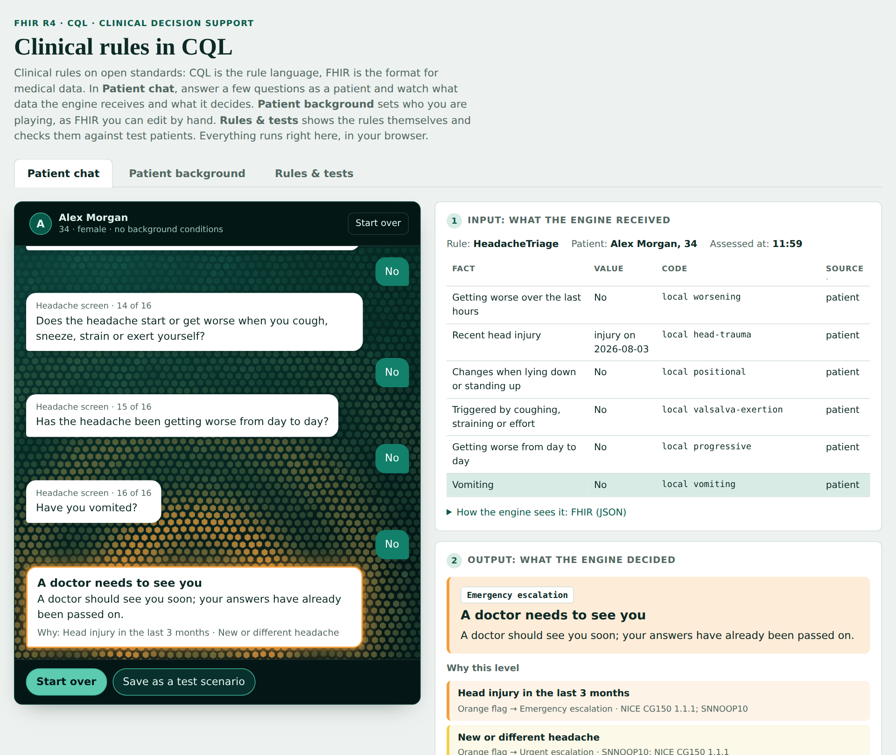

# Clinical rules in CQL over FHIR — a live demo

**Live demo: https://ytsuhen.github.io/CQL-Demo-Yevenko/** — runs entirely in the browser, nothing to install.

[](https://ytsuhen.github.io/CQL-Demo-Yevenko/)

## About

**Andrii Yevenko** · [yevenko.a.p@gmail.com](mailto:yevenko.a.p@gmail.com)

A portfolio project. It shows how clinical decision rules can be written in an open standard, tested like code and explained to people who never read code.

Two clinical rules — an adult [headache triage protocol](docs/headache-triage-protocol.md) built on NICE CG150, SNNOOP10 and the Ottawa SAH Rule, and depression/anxiety screening with PHQ-9 and GAD-7 — are written in [CQL](https://cql.hl7.org/) (HL7 Clinical Quality Language) over FHIR R4 data. Every rule is checked against test patients on each change, and a patient-facing chat shows exactly what goes into the rule engine and what comes out.

**What I did**

- Wrote two clinical modules and a shared pattern library in CQL: time windows, trusted data sources, latest value, upward-only escalation, explicit handling of missing data (“No” is a fact; a question without a value is not an answer).
- Turned an evidence-based headache triage protocol (NICE CG150, SNNOOP10, Ottawa SAH Rule, StatPearls) into a CQL module: red flags → ED, orange flags → Emergency or Urgent, ED-level questions asked first, every fired flag returned for the alert text, and 21 tests for every branch and boundary (age 39/40 and 49/50, pain 7/8, head injury 90/91 days).
- Modelled the patient background in FHIR (`Patient.birthDate` plus profile Observations) and made it editable in the page both as a form and as raw JSON.
- Mapped patient facts to FHIR `Observation`s with LOINC and SNOMED CT codes and UCUM units, including coded PHQ-9 answers.
- Built a test harness: test patients are plain JSON (facts + expected results), so clinical analysts can add cases without writing code.
- Bundled the reference CQL compiler and engine for the browser and built the web demo: a patient chat with input/output panels and a rule editor that recompiles and re-runs every test in the page.
- Set up CI on GitHub Actions (Node 20, 22, 24) that publishes the demo to GitHub Pages only when every scenario passes.

**Skills shown:** FHIR R4 · CQL / ELM · LOINC · SNOMED CT · UCUM · clinical logic with tests (headache red flags, PHQ-9, GAD-7) · turning clinical guidelines into executable rules · three-valued logic and missing data · JavaScript (Node.js, esbuild, Canvas) · GitHub Actions CI · in-browser compiler

## The demo

The page has three tabs:

- **Patient chat.** Answer with buttons as a patient: a headache screen, or the PHQ-9 and GAD-7 questionnaires (answer them yourself or pick a ready-made example). Next to the chat you see the **input** — which facts, with which codes, the engine received (also as raw FHIR) — and the **output**: the decision in plain language, the escalation level, the flags that fired with their evidence, the depression and anxiety scores and the value of every rule step. The headache screen re-runs the engine after every answer: the output is live, an orange flag alerts the care team before the screen is finished, and a red flag stops the questions at once. Skipped questions can be answered at the end. The decision message lights up the rippling hexagon background in its escalation colour. “Save as a test scenario” turns a conversation into a test patient. Hover over any button to see what it does.
- **Patient background.** Who you are playing: name, sex, age (18 or older) and medical history (pregnancy, a weakened immune system, cancer history). The form and an editable FHIR Bundle are the same data; hand edits are validated before use, and any extra FHIR resource is passed to the engine as is.
- **Rules & tests.** An editor for the rules, the code vocabulary and the test patients (picked from a list grouped by rule), a “Compile & run” button, a trace of every step and three 10-minute exercises: add a test patient, change a threshold and see what breaks, make a typo and get a precise error. Rule changes apply to the chat right away.

### Escalation levels

| Level | Headache triage | Mood screening | What the patient is told | Chat colour |
|---|---|---|---|---|
| No escalation required | Full screen, no flags, pain 0–7 | PHQ-9 < 10 and GAD-7 < 10 | No warning signs (and when to seek help again) | green |
| Urgent escalation | A new or different headache, worse with posture or coughing, worse day by day; pain 8–10 | PHQ-9 10–19 or GAD-7 ≥ 10 | We recommend talking to your doctor | yellow |
| Emergency escalation | Head injury in the last 3 months, fever with a worsening headache, a new headache with pregnancy or a weak immune system, giant cell arteritis signs at 50+ | PHQ-9 ≥ 20 | A doctor needs to see you | orange |
| ED escalation | Thunderclap onset, a neurological deficit, confusion, fever with a stiff neck, the Ottawa SAH Rule, a painful red eye; suspected carbon monoxide (leave the area first) | Any thoughts of self-harm (PHQ-9 item 9) | Seek emergency care / help urgently | red |

Missing answers never become “no escalation”: the level stays unknown and the rule asks for the data. A “No” is a real answer and never raises a flag; an Observation without a value is no answer at all. Escalation only goes up within an episode, so a repeat alert of the same or a lower level is not sent (covered by test scenarios 23 and h20). The headache protocol, its evidence and its open questions are in [docs/headache-triage-protocol.md](docs/headache-triage-protocol.md).

## Case study

**Problem.** Clinical decision rules often live inside proprietary rule editors: the logic is spread across forms, hard to review or diff, hard to test and impossible to move to another system. Errors surface as opaque failures, and a missing answer can silently turn into “nothing to worry about”.

**Approach.**

1. Express each rule in CQL, an HL7 standard, over FHIR R4 data — readable, versionable text with types checked by a compiler.
2. Move recurring logic (time windows, trusted sources, latest value, upward-only escalation) into one pattern library, so clinical modules stay short.
3. Describe test patients as JSON: facts plus expected values of any rule step. Run every scenario on every change, in the terminal and in CI.
4. Make every decision explainable: the trace shows the value of each step for each patient, and the chat shows the exact FHIR input next to the output.

**Result.**

- 2 clinical modules, 1 pattern library, 27 test scenarios (plus any saved from the chat), all green in CI on three Node.js versions.
- A guideline-based protocol (the headache screen) went from a document to executable rules with a test for every branch and boundary; the clinical owner's open questions are listed next to the evidence.
- A zero-install demo published automatically to GitHub Pages; the compiler and engine run in the visitor's browser.
- Compile errors point to `file:line:column`; three-valued logic keeps missing data unknown instead of “false”; units are compared with UCUM conversion (for example, °F against a threshold in °C).

**Next steps towards production.** A FHIR server and a terminology mapping of local codes to LOINC / SNOMED CT; a CQL engine in the production stack (for example, the Firely CQL SDK for .NET or the reference Java engine); actions through PlanDefinition / `$apply` (tasks, communication requests); a run log with inputs, outputs and the rule version; a terminology server for versioned ValueSets; and a shadow-mode run next to the existing system to compare decisions on real data before switching over.

## Pitfalls we already hit

| Pitfall | How to avoid it |
|---|---|
| Sorting by the FHIR date type: the wrong fact became the “latest” | `sort by (effective as FHIR.dateTime).value`; for every selector, a scenario with two facts at different times (h21) |
| Without a parameter value, cql-execution 3.3.2 substitutes the parameter's definition for `null` | Always pass every parameter, `null` included (`engine.mjs` does) |
| `include FHIRHelpers version '4.0.1'` while the library says `4.0.001` | The version in `include` must match `library … version` exactly |
| “Could not resolve model name System” / “No default UCUM service available” | `SystemModelInfoProvider` and the UCUM service are set up in `engine.mjs` |
| FHIR choice types: an `effective` given as a Period silently drops out of the window | Agree on the time type for every source; handle Period explicitly in `In Window` |
| A symptom Observation escalated even when the patient answered “No”, or when it had no value at all | Count a flag only on `Answered Yes` and an answer only when `Answered` (it has a value); every base answer in the headache scenarios is an explicit “No”, and h15 has an empty one |
| “Identifier Fever is already in use”: a `code` and a `define` with the same name | Name question codes as questions (`"Fever question"`) and keep the plain name for the define |

Every bug found becomes a scenario in `scenarios/`, so it cannot come back unnoticed.

## Run it yourself

### Without installing anything: GitHub Codespaces

1. On the repository page: **Code → Codespaces → Create codespace on main**. VS Code opens in the browser with a terminal at the bottom.
2. In the terminal:
   ```bash
   npm install
   npm start
   ```
3. Codespaces offers “Open in Browser” for port 8080 — that is the web version. If the prompt is gone: the **Ports** tab → the 8080 row → the globe icon.

### On your own computer

1. Install [Node.js](https://nodejs.org/) (the LTS version).
2. Get the repository: **Code → Download ZIP** and unzip it (or `git clone https://github.com/ytsuhen/CQL-Demo-Yevenko.git`).
3. Open a terminal in the project folder (Windows: right-click the folder → “Open in Terminal”; macOS: Terminal, type `cd ` and drag the folder into the window) and run:
   ```bash
   npm install
   npm start
   ```
4. Open http://localhost:8080. Stop it with `Ctrl + C` in the terminal.

### Commands

```bash
npm install        # once: the compiler and the engine, ~50 MB
npm start          # build the web version and serve it on http://localhost:8080
npm test           # compile + every scenario in the terminal, PASS / FAIL
npm run trace      # the same plus the value of every define
npm run compile    # compile into elm/ only, no scenarios
npm run build      # build the web version into dist/ only
```

Pick scenarios by the start of the file name: `npm run trace -- h04 21`.

`npm test` and `npm run compile` exit with code 1 on a compilation error or any FAIL, so they work in CI as is.

```
Compiled: 4 of 4 libraries

PASS  h21-latest-pain-score.json  [HeadacheTriage] Two pain scores, 9 earlier and 4 now -> the latest one counts, no escalation
        Window                   = [2026-10-01T02:00:00.000+00:00 .. 2026-10-01T14:00:00.000+00:00]
        Age                      = 35
        Headache Reported        = true
        Applies                  = true
      ✓ Pain Now                 = 4
        Onset Peak               = over-60-min
        Similarity To Usual      = usual
        New Or Changed Pain      = false
        ...
        Severe Pain              = false
        ED Questions Answered    = true
        Other Questions Answered = true
        Ask Headache Screen      = false
      ✓ Proposed Level           = No escalation required
        New Level                = null
      ✓ Disposition              = Reassure
      ✓ Fired Flags              = []
...
27 / 27 PASS
```

✓ marks a step the scenario's `expect` checks; ✗ marks one that did not match. `null` means “no value”: the rule never silently turns it into `false`.

The demo page updates itself: after every push to `main`, GitHub Actions runs the scenarios and, if everything is green, publishes a new build to the `gh-pages` branch (see `.github/workflows/test.yml`). For the very first deployment of a fork, enable **Settings → Pages → Build and deployment → Source: Deploy from a branch → `gh-pages` / `(root)`**.

## How it works

The core is `engine.mjs`; both the terminal commands and the web version use it (for the browser it is bundled into a single `engine.js`).

1. **Compilation.** The cqframework reference translator, built for JavaScript (`@cqframework/cql`), checks types and references in `cql/*.cql` and produces ELM. Errors are reported as `cql/File.cql:line:column`.
2. **Data.** Every scenario fact becomes a FHIR `Observation`: a LOINC, SNOMED CT or local code, a value (a number, a coded answer such as LOINC LA33-6 “Yes”, or a date), `effectiveDateTime`, and the source in `meta.tag`. The `Patient` (with `birthDate`) and any ready-made resources from the patient background go into the same Bundle.
3. **Execution.** The `cql-execution` engine with the `cql-exec-fhir` adapter runs the ELM for the patient at the moment `now` with the `Last Run` and `Current Level` parameters; ValueSets come from `vocabulary.json`. The result is the value of every `define`, compared with `expect`.

| File | Role | Change it when |
|---|---|---|
| `cql/HeadacheTriage.cql` | Clinical module: adult headache triage (red and orange flags) | The protocol changes |
| `cql/MoodScreening.cql` | Clinical module: PHQ-9 and GAD-7 screening | Cut-offs or escalation levels change |
| `docs/headache-triage-protocol.md` | The headache protocol: branches, questions, evidence, test plan, open questions | Before changing `HeadacheTriage.cql` |
| `cql/RulePatterns.cql` | Pattern library shared by the modules | A pattern is added or fixed |
| `cql/FHIRHelpers.cql` | Standard HL7 library from ecqm-content-r4 (version renamed to 4.0.1) | Never |
| `vocabulary.json` | ValueSets: URL → list of codes (e.g. the answers that make a headache “new”) | A code or a group of codes is added |
| `scenarios/*.json` | Test patients with the expected result | A new test |
| `engine.mjs` | Core: compilation, FHIR data, execution, comparison, trace | A new fact type or rule parameter |
| `test.mjs` | Scenario run in the terminal, PASS / FAIL | Rarely |
| `compile.mjs` | Compilation into `elm/` in the terminal | Rarely |
| `web/index.html` | The web page: patient chat, patient background, editor, results, exercises | Texts, chat questions, look and feel |
| `web/build.mjs`, `web/serve.mjs` | Builds the web version into `dist/`; local server | Rarely |
| `elm/`, `dist/` | Compilation and build output | Never: regenerated, not in git |

## Scenario format

```json
{
  "name": "Head injury 90 days ago -> emergency escalation (window boundary)",
  "rule": "HeadacheTriage",
  "now": "2026-10-01T14:00:00Z",
  "lastRun": null,
  "currentLevel": null,
  "birthDate": "1991-04-15",
  "facts": [
    { "kind": "headache", "answer": "Yes", "at": "2026-10-01T13:50:00Z", "source": "Patient" },
    { "kind": "headache-screen", "code": "onset-peak", "answer": "over-60-min", "at": "2026-10-01T13:50:00Z", "source": "Patient" },
    { "kind": "headache-screen", "code": "neuro-deficit", "answer": "No", "at": "2026-10-01T13:50:00Z", "source": "Patient" },
    { "kind": "headache-screen", "code": "head-trauma", "date": "2026-07-03", "at": "2026-10-01T13:50:00Z", "source": "Patient" },
    { "kind": "pain", "value": 5, "at": "2026-10-01T13:50:00Z", "source": "Patient" }
  ],
  "expect": { "Recent Head Trauma": true, "Proposed Level": "Emergency escalation", "Disposition": "Provider evaluation required" }
}
```

(Shortened: the real `scenarios/h13-trauma-90-days.json` answers every screening question.)

- `rule` — which rule to run (HeadacheTriage if omitted).
- `birthDate` or `patient` — the patient's birth date, or a whole FHIR `Patient` resource; `resources` — any other ready-made FHIR resources (the patient background), passed to the engine as they are.
- `now`, `lastRun`, `at` — any ISO time (`…Z` or `…+03:00`); the engine works in UTC.
- `currentLevel` — the escalation level the patient already has; a new alert goes out only for a higher one.
- `facts[].kind` — a shorthand: `pain`, `phq9`, `gad7` (a number in `value`), `phq9-item9` (an answer in `answer`: “Not at all”, “Several days”…), `headache` (`answer`: “Yes” / “No”), `headache-screen` and `profile` (a local `code` with an `answer`, or a `date` for `head-trauma`), or any fact via `system` + `code` + `value` + `unit` (UCUM). A fact with neither `value`, `answer` nor `date` is a question that was asked but not answered.
- `facts[].source` — the source tag: symptoms and answers count only from `Patient` and `RPM` (remote patient monitoring); a `MANUAL` entry by a clinician is not a patient report. Background facts (`profile`) also accept `MANUAL`.
- `expect` checks only the listed steps, so a scenario can watch a single `define`.

## Making changes

Almost every change is an edit to one file plus `npm test`:

1. **A new test patient** — a new file in `scenarios/`, no code.
2. **A new fact type** — a code and a UCUM unit in the scenario; `engine.mjs` builds the `valueQuantity` itself.
3. **A new code or group of codes** — a `code` in the rule, or a `valueset` with its address in the rule and its codes in `vocabulary.json` (the address must match, or the engine stops with `Unable to resolve expected valueset`).
4. **A new rule** — `cql/<Name>.cql` plus scenarios with `"rule": "<Name>"`; no code changes, and the new rule shows up in the web version by itself.
5. **A new pattern** — a function in `cql/RulePatterns.cql`, visible to every rule at once. After the change, `npm test` runs the scenarios of every rule.

---

The escalation levels in the rules are illustrative: this demonstrates an approach, not a clinical recommendation. The PHQ-9 (5/10/15/20) and GAD-7 (5/10/15) severity cut-offs are the published ones; the headache screen follows NICE CG150, SNNOOP10 and the Ottawa SAH Rule (see the [protocol](docs/headache-triage-protocol.md) for its evidence limits). All patients are synthetic. If you or someone you know is struggling, contact your local emergency number or a crisis line (988 in the US).

Compiler: [@cqframework/cql](https://www.npmjs.com/package/@cqframework/cql) 5.4.0. Engine: [cql-execution](https://github.com/cqframework/cql-execution) 3.3.2 + [cql-exec-fhir](https://github.com/cqframework/cql-exec-fhir) 2.2.0. FHIR R4. `FHIRHelpers.cql` comes from [ecqm-content-r4](https://github.com/cqframework/ecqm-content-r4) (HL7 / cqframework, CC0).
